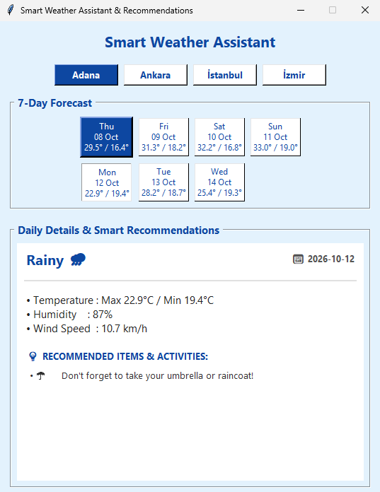
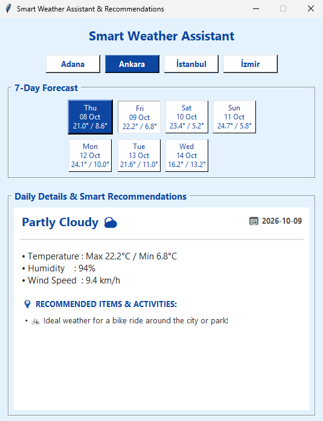
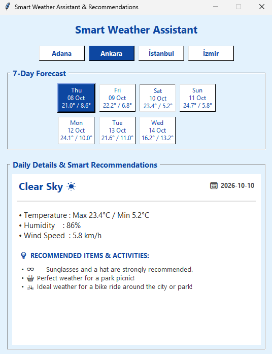
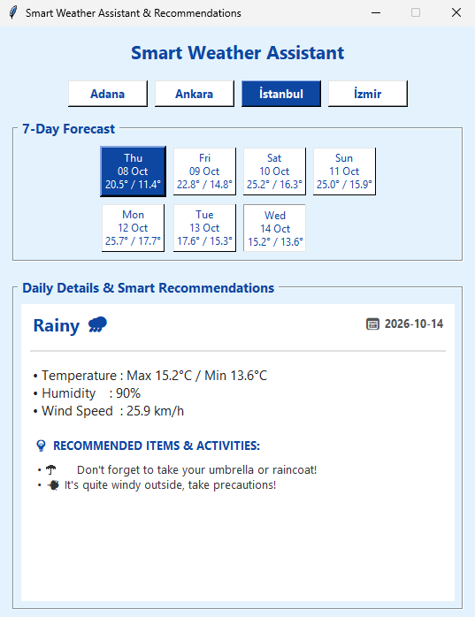

# 🌤️ Smart Weather Assistant & Recommendations

A modern multi-city desktop weather application built with **Python** and **Tkinter**. This application fetches real-time meteorological data using the **Open-Meteo API** without requiring any API keys, provides a 7-day forecast with interactive date selection, and generates smart daily recommendations (such as clothing and activity suggestions based on weather conditions).

## 🚀 Features

- **Multi-City Support:** Instant switching between major cities (Adana, Ankara, Istanbul, Izmir) with automated coordinate mapping.
- **Real-Time API Integration:** Fetches live 7-day forecast data including temperatures, weather codes, maximum humidity, and wind speeds.
- **Interactive 7-Day Forecast:** Clean grid-card layout where today is automatically highlighted with a distinct corporate theme.
- **Smart Recommendation Engine:** Dynamically suggests items and activities based on weather conditions (e.g., umbrella for rainy days, sunglasses for clear skies, or city/park cycling tips).
- **Modern UI / UX:** Designed with a refreshing blue bank-assistant theme, clean typography (`Segoe UI`), and a clear visual hierarchy.

---

## 📸 App Screenshots

| Dashboard & Overview | Forecast Grid Selection |
| :---: | :---: |
|  |  |

| Detailed View & Recommendations | Multi-City Switching |
| :---: | :---: |
|  |  |

---

## 🛠️ Technologies Used

- **Python 3.x**
- **Tkinter** (Standard GUI framework)
- **Urllib & Json** (For handling HTTP requests and parsing live JSON API responses)
- **Open-Meteo REST API** (Weather data source)

---

## ⚙️ How to Run

1. Make sure you have Python installed on your system.
2. Download or clone this repository:
   ```bash
   git clone [https://github.com/ata-yilmaz/python-smart-weather-assistant.git](https://github.com/ata-yilmaz/python-smart-weather-assistant.git)
